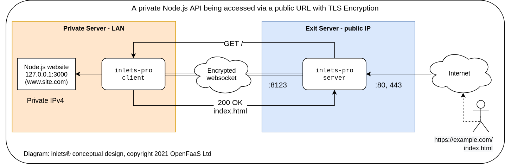

# Cloud Native Tunnel

You can use inlets to connect HTTP and TCP services between networks securely. Through an encrypted websocket, inlets can penetrate firewalls, NAT, captive portals, and other restrictive networks lowering the barrier to entry.

VPNs traditionally require up-front configuration like subnet assignment and ports to be opened in firewalls. A tunnel with inlets can provide an easy-to-use, low-maintenance alternative to VPNs and other site-to-site networking solutions. 

You can run inlets as a stand-alone binary, in Docker, integrated into [Kubernetes](https://kubernetes.io) for [Ingress](https://kubernetes.io/docs/concepts/services-networking/ingress/), or with cloud APIs. All services can be kept private in the target network, or exposed publicly.

> [inlets PRO](https://inlets.dev/) is available for MacOS, Linux (including ARM), Windows, FreeBSD, and as Docker containers.

## Use-cases

### For companies - hybrid cloud, multi-cluster and partner access

* To connect hundreds or thousands of clients without making them part of your corporate network 
* To migrate on-premises databases and APIs to public cloud
* Exposing private API endpoints to third-parties and partners
* To build a hybrid cloud between existing servers and public cloud for: CI, e2e testing, or for accessing legacy databases and IT systems
* Low-maintenance, secure, and quick alternative to a VPN
* To connect to the private environments of your customers in a SaaS product
* For command and control of: services within private VPCs, IoT devices, and Point of Sale (PoS)
* As a cheaper, easier alternative to a data-center uplink or managed product like AWS Direct Connect or Azure Express Route

### For teams and individuals - for public tunnels and Kubernetes connectivity

* As a zero-touch VPN - penetrating NAT, firewalls, captive portals and hotel WiFi
* When integrating with API that use webhooks such as Stripe, PayPal or GitHub, you can test live with your local machine
* To get a public IP address for your IngressController or services on a Kubernetes cluster
* To access your homelab, Owncloud instance, FreeNAS, or Raspberry Pi cluster using SSH and HTTPS
* As a freelancer, you can share a blog or website with a client or with your team
* As an alternative to SaaS tunnels which enforce certain rate-limits, random ports or prevent custom DNS

## Concept

[Inlets PRO](https://inlets.dev/) provides HTTPS and TCP tunnels with built-in TLS encryption.

You can start a HTTPS or TCP tunnel:

* HTTPS (L7) tunnels can be used to connect one or more HTTP endpoints from one network to another. A single tunnel can expose multiple websites or hosts, including LoadBalancing and multiple clients to one server.
* TCP (L4) tunnels can be used to connect TCP services such as a database, a reverse proxy, RDP, Kubernetes or SSH to the Internet. A single tunnel can expose multiple ports on an exit-server

inlets PRO has secure defaults and includes additional documentation, examples, and integrations to make it easier to use. It also has a commercial license and support available.

In the diagram we can see a developer has exposed a Node.js website on his or her laptop through the use of inlets and a server that has a public IPv4 address.

The remote server is called an "exit-node" or "exit-server" because that is where traffic from the private network appears. The user's laptop has gained a "VirtualIP" and users on the Internet can now connect to it using that IP.

TCP tunnels are also supported, which encrypt and forward a number of TCP ports to an upstream within your private network.

> A split data and control-plane mean that tunnels do not need to be exposed on the Internet and can replace a VPN or a bespoke solution with SSH tunnels 

## Exit-servers

An exit-server is a host that runs the `inlets-pro server` command to expose its control-plane (websocket) to tunnel clients. The tunnel client can then connect to the exit-server and make services within its local network available remotely.

Services are tunnelled through the exit-server, however unlike SaaS products such as Ngrok and Argo Tunnels, they do not need to be exposed on the public Internet. 

Exit servers can be set up manually, or you can use tooling like [Terraform](https://www.terraform.io), bash, cloud-init or additional inlets community projects:

* [inletsctl](https://github.com/inlets/inletsctl)  - create individual exit-servers
* [inlets-operator](https://github.com/inlets/inlets-operator) - get an exit-server for each LoadBalancer service in your Kubernetes cluster
* [inlets PRO helm charts](https://github.com/inlets/inlets-pro/tree/master/chart) - deploy one or more inlets PRO clients or servers to your Kubernetes cluster via helm

> These share the same provisioning code and create exit-servers on a range of cloud platforms like: DigitalOcean, Equinix Metal, AWS EC2, Azure, GCP, Vultr, Scaleway, Hetzner and Linode.

## Tutorials

### Getting started with your free trial

We created a page to help you get started once you have your free trial license:

* [Get started with your free trial](/get-started/free-trial?id=get-started-with-your-free-trial)

### inlets PRO

* [Quick-start: Expose a private SSH endpoint using a TCP tunnel](/get-started/quickstart-tcp-ssh)
* [Expose a local HTTP server with a Let's Encrypt certificate](/get-started/quickstart-http)
* [Quick-start: Tunnel a private database over inlets PRO](/get-started/quickstart-tcp-database)

* [Quick-start: Expose one or more websites with HTTPS using Caddy](/get-started/quickstart-caddy)
* [Expose Apache Cassandra running on your local machine, out to another network with TLS encryption](https://github.com/inlets/inlets-pro/blob/master/docs/cassandra-tutorial.md)
* [Expose your private Grafana devops dashboards with Caddy and TLS](https://blog.alexellis.io/expose-grafana-dashboards/)
* [Case-study: The Simple Way To Connect Existing Apps to Public Cloud](https://inlets.dev/blog/2021/04/07/simple-hybrid-cloud.html)

* [Host an inlets PRO tunnel for free on fly.io](https://inlets.dev/blog/2021/07/07/inlets-fly-tutorial.html)

### inlets PRO with Kubernetes

* [Case-study: Reliable local port-forwarding from Kubernetes](https://inlets.dev/blog/2021/04/13/local-port-forwarding-kubernetes.html)
* [Fixing Ingress for short-lived local Kubernetes clusters](https://inlets.dev/blog/2021/07/08/short-lived-clusters.html)
* [Quick-start: Expose Your IngressController and get TLS from LetsEncrypt and cert-manager](/get-started/quickstart-ingresscontroller-cert-manager?id=expose-your-ingresscontroller-and-get-tls-from-letsencrypt)
* [Expose your local OpenFaaS functions to the Internet](https://inlets.dev/blog/2020/10/15/openfaas-public-endpoints.html)
* [Get kubectl access to your private cluster from anywhere](https://blog.alexellis.io/get-private-kubectl-access-anywhere/)
* [Get a private Docker registry with auth and TLS](https://blog.alexellis.io/get-a-tls-enabled-docker-registry-in-5-minutes/)
* [Quick-start: Expose a Pod from your Kubernetes cluster with KinD](/get-started/quickstart-k8s-pod)

### inlets PRO Community blog posts

* [Inlets Pro Homelab Awesomeness by Matt Brewster](https://blog.brewsterops.dev/post/inlets-pro-homelab/)
* [Save Money by Connecting Your Local Database to the Public Cloud by Burton Rheutan](https://medium.com/@burtonr/local-database-for-the-cloud-with-inlets-pro-ac0488cc54e0)
* [Exploring NAT Traversal and Tunnels with Inlets and Inlets Pro by Alistair Hey](https://blog.heyal.co.uk/inlets-pro/)

### Managed inlets with inlets cloud
* [Advanced Cloud Patterns & inlets-cloud](https://inlets.dev/blog/2020/10/08/advanced-cloud-patterns.html)
* [How we scaled inlets to thousands of tunnels with Kubernetes](https://inlets.dev/blog/2021/03/15/scaling-inlets.html)
* [Learn how to manage apps across private Kubernetes clusters](https://inlets.dev/blog/2021/06/02/argocd-private-clusters.html)

## Reference documentation

### inletsctl reference documentation

inletsctl creates pre-installed tunnel servers for you on a range of cloud providers:

* [inletsctl documentation](/tools/inletsctl?id=inletsctl-reference-documentation)

### inlets-operator reference documentation

inlets-operator is similar to inletsctl, but works as a Kubernetes operator to create tunnel servers for your LoadBalancer services:

* [inlets-operator documentation](/tools/inlets-operator?id=inlets-operator-reference-documentation)

### inlets PRO reference documentation

Learn CLI options for the inlets-pro command line tool:

* [inlets PRO CLI reference guide](https://github.com/inlets/inlets-pro/blob/master/docs/cli-reference.md)

## Pricing

You can buy an inlets PRO license for personal or commercial use [on Gumroad](https://inlets.dev/pricing).

> Note: inlets OSS has been discontinued and was replaced by inlets PRO. inlets PRO is a drop-in replacement.
> 
> Going forward inlets and inlets PRO will be used interchangeably to mean the same product and offering.

## Connect with the community

If you follow [@inletsdev](https://twitter.com/inletsdev) on Twitter, you'll be able to stay up to date with offers, news and blog posts.

To chat with the maintainers and for support, join the `#inlets` channel on [OpenFaaS Slack](https://slack.openfaas.io/)

## Got a question? Found a problem?

If you have questions or comments, feel free to reach out to the team at [contact@openfaas.com](contact@openfaas.com).

* [Raise an issue on the docs website](https://github.com/inlets/docs)
* [Raise an issue for the blog or main website](https://github.com/inlets/inlets.dev)

### Featured on

inlets is proud to be featured on the Cloud Native Landscape in the Service Proxy category.

